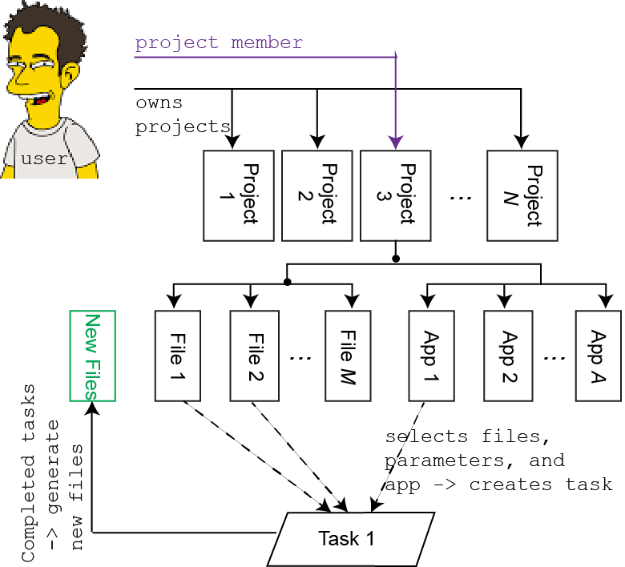
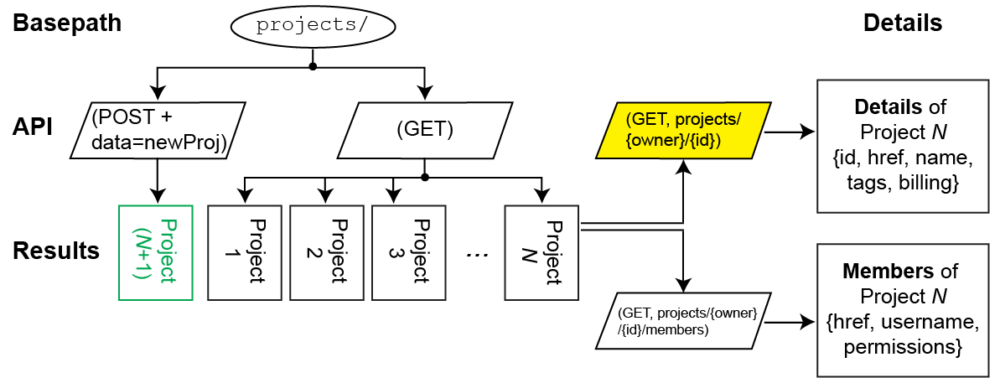
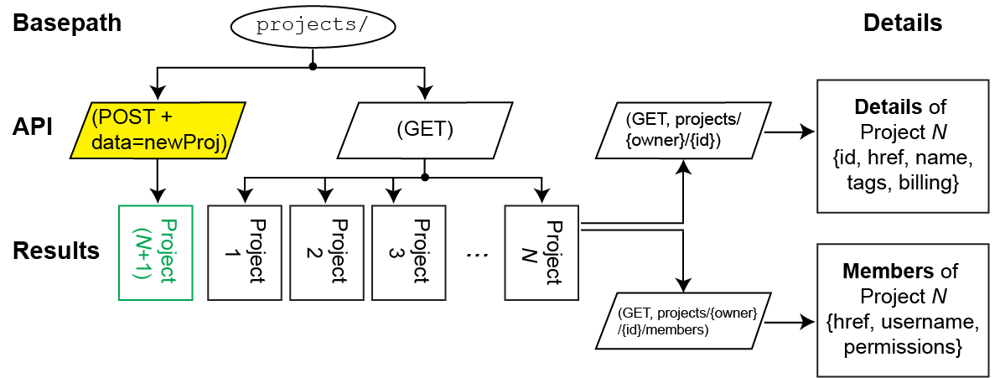

# API Recipes for the Seven Bridges Platform (SBPLAT)
Our  goals were to 

* Educate users about how the API works by using a friendly Python wrapper
* Provide re-usable blocks of API code to solve common problems

We also wanted to:

* Use open access files
* Show both the _wrapped_ calls and _more raw_ calls which more closely match our extensive [documentation](http://docs.sevenbridges.com/docs/the-cgc-api)
 
## How does the SBPLAT work?
An important first concept is how the SBPLAT (and CGC) works. A user has access to multiple **projects**, she may either be the owner of those projects or a member of someone else's project. Within each project, there is a collection of **files** and **apps**. The owner can combine a set of files, configuration inputs, and an app to generate a **task**. Once this task is complete, any **output files** will be put into
the project where the task was started.



## Recipes in this cookbook
 
Each of the main components in the CGC is accessible by the API. Generally there is a similar strategy, e.g. everything
related to **projects** will have 
```python 
path = 'projects'  
```
as the base. Using the 
```python
method='GET'
method='POST'
```
will determine whether you are listing or creating a project. Queries and data further help refine functionality. For example adding
```python 
query = {'project', project_id}  
```
will **detail** the single project with (id=project\_id). Omitting that query will **list** all of your projects. These recipes are _purposefully_ repetitive to highlight the logic of the API and hopefully help users understand some of the tools available to solve problems. The current _cookbook_ includes<sup>1</sup>

* Projects
  * list [projects_listsAll.ipynb]
  * get details [projects_detailOne.ipynb]
  * get members [projects_membersOne.ipynb]
  * make new [projects_makeNew.ipynb]
* Files
 * list (within a project) [files_listAll.ipynb]
 * get details [files_detailOne.ipynb]
 * copy Public Reference file [files_copyFromMyProject.ipynb]
 * copy from another project [files_copyFromPublicReference.ipynb]
* Apps
 * list [apps_listAll.ipynb]
 * get details [apps_detailOne.ipynb]
 * copy from Public Apps [apps_copyFromPublicApps.ipynb]
 * copy from another project [apps_copyFromMyProject.ipynb]
* Tasks
 * create and start [tasks_create.ipynb]
 * monitor & get outputs [tasks_monitorAndGetResults.ipynb ]

### Notes
<sup>1</sup> We are happy to add more cookbooks, please request what helps you most effectively get stuff done. Already in the queue are:
 
* [files_makeProcessingList]. A way to screen through the metadata on all the files in your project. Can be passed to a (or a batch of) task(s)
* [files_uploadViaAPI] New functionality to upload files via the API
* [files_setMetadata] Create or adapt the metadata of a (non-TCGA) file on the CGC. **see also** _Tutorials/SBPLAT/quickstart_RNAseq.ipynb_ for an example of this


### Extra Pictures of API calls




